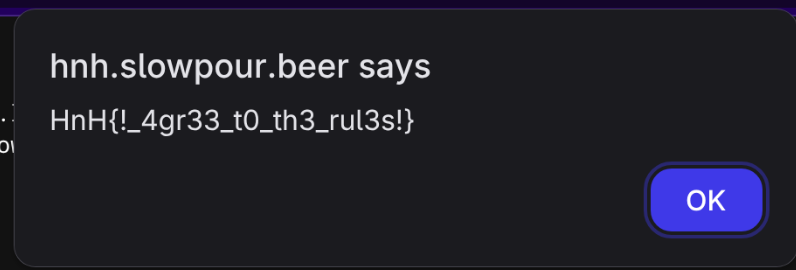
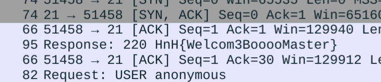
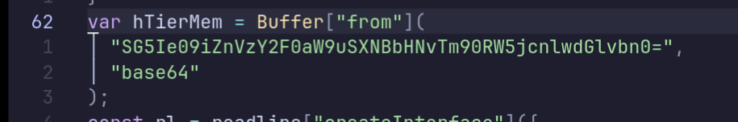
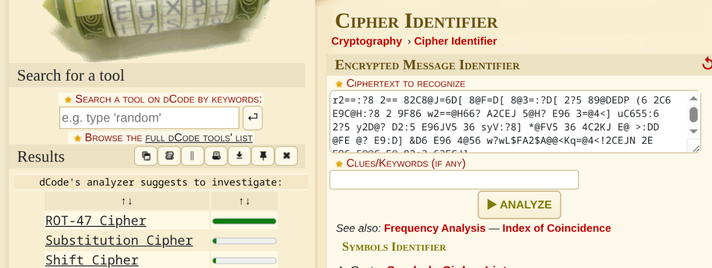
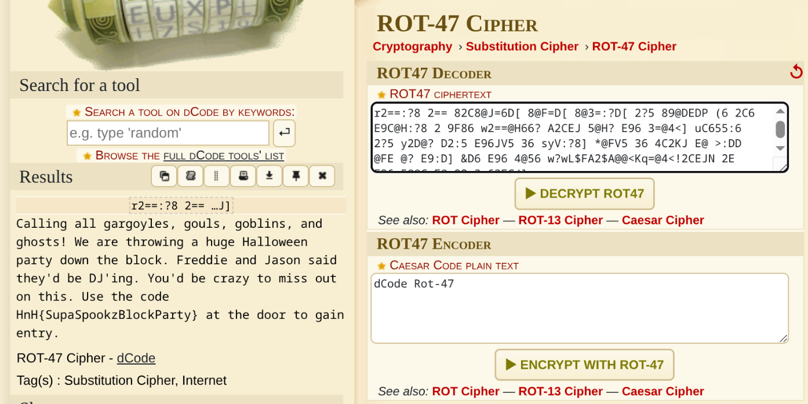
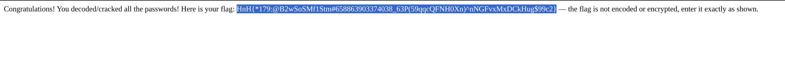

# HnH Slow Pour CTF Writeup

## Misc 

### Welcome Challenge - (5 Points)

##### Challenge Description: 
Welcome to the Hackers N' Hops Slow Pour CTF! 🍺

Before diving into the technical challenges, we need all participants to read and acknowledge our Code of Conduct. This isn't just bureaucratic paperwork - it's essential for maintaining a positive learning environment for everyone.

Your mission: Navigate to the Code of Conduct page and thoroughly read through all the guidelines. Show us you've read everything by finding the hidden agreement mechanism. This is basically free points for doing what every good CTF participant should do anyway - understanding the rules! Plus, you might learn something about how we approach cybersecurity education at HnH.

Hint: Sometimes the best flags come to those who... scroll with patience. 😉 Note: This challenge requires no technical exploitation - just good old-fashioned reading comprehension and a willingness to follow directions.

##### Writeup: 
I directly went to the **Code of Conduct / Rules**  page and viewed its page source (as I always do with such challs). Search for **HnH{** but wasn't able to find one (and didn't dare to look over the 107 results of HnH) so searched for **flag** and over the end found the below code 
``` javascript 
// Check if human behavior detected
        if (humanScrollDetected && mouseMovements > 5) {
            flagShown = true;
            setTimeout(function() {[][(![]+[])[+[]]+(![]+[])[!+[]+!+[]]+(![]+[])[+!+[]]+(!![]+[])[+[]]][([][(![]+[])[+[]]+(![]+[])[!+[]+!+[]]+(![]+[])[+!+[]]+(!![]+[])[+[]]]+[])[!+[]+!+[]+!+[]]+(!![]+[][(![]+[])[+[]]+(![]+[])[!+[]+!+[]]+(![]+[])[+!+[]]+(!![]+[])[+[]]])[+!+[]+[+[]]]+([][[]]+[])[+!+[]]+(![]+[])[!+[]+!+[]+!+[]]+(!![]+[])[+[]]+(!![]+[])[+!+[]]+([][[]]+[])[+[]]+([][(![]+[])[+[]]+(![]+[])[!+[]+!+[]]+(![]+[])[+!+[]]+(!![]+[])[+[]]]+[])[!+[]+!+[]+!+[]]+(!![]+[])[+[]]+(!![]+[][(![]+[])[+[]]+(![]+[])[!+[]+!+[]]+(![]+[])[+!+[]]+(!![]+[])[+[]]])[+!+[]+[+[]]]+(!![]+[])[+!+[]]]([][(![]+[])[+[]]+(![]+[])[!+[]+!+[]]+(![]+[])[+!+[]]+(!![]+[])[+[]]][([][(![]+[])[+[]]+(![]+[])[!+[]+!+[]]+(![]+[])[+!+[]]+(!![]+[])[+[]]]+[])[!+[]+!+[]+!+[]]+(!![]+[][(![]+[])[+[]]+(![]+[])[!+[]+!+[]]+(![]+[])[+!+[]]+(!![]+[])[+[]]])[+!+[]+[+[]]]+([][[]]+[])[+!+[]]+(![]+[])[!+[]+!+[]+!+[]]+(!![]+[])[+[]]+(!![]+[])[+!+[]]+([][[]]+[])[+[]]+([][(![]+[])[+[]]+(![]+[])[!+[]+!+[]]+(![]+[])[+!+[]]+(!![]+[])[+[]]]+[])[!+[]+!+[]+!+[]]+(!![]+[])[+[]]+(!![]+[][(![]+[])[+[]]+(![]+[])[!+[]+!+[]]+(![]+[])[+!+[]]+(!![]+[])[+[]]])[+!+[]+[+[]]]+(!![]+[])[+!+[]]]((!![]+[])[+!+[]]+(!![]+[])[!+[]+!+[]+!+[]]+(!![]+[])[+[]]+([][[]]+[])[+[]]+(!![]+[])[+!+[]]+([][[]]+[])[+!+[]]+([]+[])[(![]+[])[+[]]+(!![]+[][(![]+[])[+[]]+(![]+[])[!+[]+!+[]]+(![]+[])[+!+[]]+(!![]+[])[+[]]])[+!+[]+[+[]]]+([][[]]+[])[+!+[]]+(!![]+[])[+[]]+([][(![]+[])[+[]]+(![]+[])[!+[]+!+[]]+(![]+[])[+!+[]]+(!![]+[])[+[]]]+[])[!+[]+!+[]+!+[]]+(!![]+[][(![]+[])[+[]]+(![]+[])[!+[]+!+[]]+(![]+[])[+!+[]]+(!![]+[])[+[]]])[+!+[]+[+[]]]+(![]+[])[!+[]+!+[]]+(!![]+[][(![]+[])[+[]]+(![]+[])[!+[]+!+[]]+(![]+[])[+!+[]]+(!![]+[])[+[]]])[+!+[]+[+[]]]+(!![]+[])[+!+[]]]()[+!+[]+[!+[]+!+[]]]+((![]+[])[+!+[]]+(![]+[])[!+[]+!+[]]+(!![]+[])[!+[]+!+[]+!+[]]+(!![]+[])[+!+[]]+(!![]+[])[+[]]+[+!+[]]+[!+[]+!+[]+!+[]+!+[]+!+[]+!+[]]+[!+[]+!+[]+!+[]+!+[]]+(!![]+[])[+[]]+[!+[]+!+[]+!+[]+!+[]+!+[]]+[+[]]+(!![]+[])[+[]]+[!+[]+!+[]+!+[]+!+[]]+[!+[]+!+[]]+(!![]+[])[+[]]+[+!+[]]+[+!+[]]+[+[]]+([][[]]+[])[+!+[]]+(!![]+[])[+[]]+[+!+[]]+[+!+[]]+[+[]]+(!![]+[])[+[]]+[+!+[]]+[!+[]+!+[]+!+[]+!+[]+!+[]+!+[]+!+[]]+[!+[]+!+[]+!+[]]+(!![]+[])[+[]]+[!+[]+!+[]+!+[]+!+[]]+[+!+[]]+(!![]+[])[+[]]+[+!+[]]+[!+[]+!+[]+!+[]]+[!+[]+!+[]+!+[]+!+[]+!+[]+!+[]+!+[]]+[!+[]+!+[]+!+[]+!+[]]+(!![]+[])[+[]]+[+!+[]]+[!+[]+!+[]+!+[]+!+[]]+[!+[]+!+[]+!+[]+!+[]+!+[]+!+[]+!+[]]+(!![]+[])[+!+[]]+[!+[]+!+[]+!+[]]+[!+[]+!+[]+!+[]]+(!![]+[])[+[]]+[+!+[]]+[!+[]+!+[]+!+[]]+[!+[]+!+[]+!+[]+!+[]+!+[]+!+[]+!+[]]+(!![]+[])[+[]]+[+!+[]]+[!+[]+!+[]+!+[]+!+[]+!+[]+!+[]]+[!+[]+!+[]+!+[]+!+[]]+[+[]]+(!![]+[])[+[]]+[+!+[]]+[!+[]+!+[]+!+[]]+[!+[]+!+[]+!+[]+!+[]+!+[]+!+[]+!+[]]+(!![]+[])[+[]]+[+!+[]]+[!+[]+!+[]+!+[]+!+[]+!+[]+!+[]]+[!+[]+!+[]+!+[]+!+[]]+(!![]+[])[+[]]+[+!+[]]+[!+[]+!+[]+!+[]+!+[]+!+[]]+[+[]]+[!+[]+!+[]+!+[]]+(!![]+[])[+[]]+[+!+[]]+[!+[]+!+[]+!+[]]+[!+[]+!+[]+!+[]+!+[]+!+[]+!+[]+!+[]]+(!![]+[])[+!+[]]+([][[]]+[])[+[]]+(![]+[])[!+[]+!+[]]+[!+[]+!+[]+!+[]]+(![]+[])[!+[]+!+[]+!+[]]+(!![]+[])[+[]]+[!+[]+!+[]+!+[]+!+[]]+[+!+[]]+(!![]+[])[+[]]+[+!+[]]+[!+[]+!+[]+!+[]+!+[]+!+[]+!+[]+!+[]]+[!+[]+!+[]+!+[]+!+[]+!+[]]+(!![]+[])[+[]]+[!+[]+!+[]+!+[]+!+[]]+[!+[]+!+[]]+(!![]+[])[+[]]+[!+[]+!+[]+!+[]+!+[]+!+[]]+[+!+[]]+(!![]+[])[+[]]+[!+[]+!+[]+!+[]+!+[]+!+[]+!+[]+!+[]]+[!+[]+!+[]+!+[]])[(![]+[])[!+[]+!+[]+!+[]]+(+(!+[]+!+[]+[+!+[]]+[+!+[]]))[(!![]+[])[+[]]+(!![]+[][(![]+[])[+[]]+(![]+[])[!+[]+!+[]]+(![]+[])[+!+[]]+(!![]+[])[+[]]])[+!+[]+[+[]]]+([]+[])[([][(![]+[])[+[]]+(![]+[])[!+[]+!+[]]+(![]+[])[+!+[]]+(!![]+[])[+[]]]+[])[!+[]+!+[]+!+[]]+(!![]+[][(![]+[])[+[]]+(![]+[])[!+[]+!+[]]+(![]+[])[+!+[]]+(!![]+[])[+[]]])[+!+[]+[+[]]]+([][[]]+[])[+!+[]]+(![]+[])[!+[]+!+[]+!+[]]+(!![]+[])[+[]]+(!![]+[])[+!+[]]+([][[]]+[])[+[]]+([][(![]+[])[+[]]+(![]+[])[!+[]+!+[]]+(![]+[])[+!+[]]+(!![]+[])[+[]]]+[])[!+[]+!+[]+!+[]]+(!![]+[])[+[]]+(!![]+[][(![]+[])[+[]]+(![]+[])[!+[]+!+[]]+(![]+[])[+!+[]]+(!![]+[])[+[]]])[+!+[]+[+[]]]+(!![]+[])[+!+[]]][([][[]]+[])[+!+[]]+(![]+[])[+!+[]]+((+[])[([][(![]+[])[+[]]+(![]+[])[!+[]+!+[]]+(![]+[])[+!+[]]+(!![]+[])[+[]]]+[])[!+[]+!+[]+!+[]]+(!![]+[][(![]+[])[+[]]+(![]+[])[!+[]+!+[]]+(![]+[])[+!+[]]+(!![]+[])[+[]]])[+!+[]+[+[]]]+([][[]]+[])[+!+[]]+(![]+[])[!+[]+!+[]+!+[]]+(!![]+[])[+[]]+(!![]+[])[+!+[]]+([][[]]+[])[+[]]+([][(![]+[])[+[]]+(![]+[])[!+[]+!+[]]+(![]+[])[+!+[]]+(!![]+[])[+[]]]+[])[!+[]+!+[]+!+[]]+(!![]+[])[+[]]+(!![]+[][(![]+[])[+[]]+(![]+[])[!+[]+!+[]]+(![]+[])[+!+[]]+(!![]+[])[+[]]])[+!+[]+[+[]]]+(!![]+[])[+!+[]]]+[])[+!+[]+[+!+[]]]+(!![]+[])[!+[]+!+[]+!+[]]]](!+[]+!+[]+!+[]+[+!+[]])[+!+[]]+(![]+[])[!+[]+!+[]]+([![]]+[][[]])[+!+[]+[+[]]]+(!![]+[])[+[]]]((!![]+[])[+[]])[([][(!![]+[])[!+[]+!+[]+!+[]]+([][[]]+[])[+!+[]]+(!![]+[])[+[]]+(!![]+[])[+!+[]]+([![]]+[][[]])[+!+[]+[+[]]]+(!![]+[])[!+[]+!+[]+!+[]]+(![]+[])[!+[]+!+[]+!+[]]]()+[])[!+[]+!+[]+!+[]]+(!![]+[][(![]+[])[+[]]+(![]+[])[!+[]+!+[]]+(![]+[])[+!+[]]+(!![]+[])[+[]]])[+!+[]+[+[]]]+([![]]+[][[]])[+!+[]+[+[]]]+([][[]]+[])[+!+[]]](([][(![]+[])[+[]]+(![]+[])[!+[]+!+[]]+(![]+[])[+!+[]]+(!![]+[])[+[]]][([][(![]+[])[+[]]+(![]+[])[!+[]+!+[]]+(![]+[])[+!+[]]+(!![]+[])[+[]]]+[])[!+[]+!+[]+!+[]]+(!![]+[][(![]+[])[+[]]+(![]+[])[!+[]+!+[]]+(![]+[])[+!+[]]+(!![]+[])[+[]]])[+!+[]+[+[]]]+([][[]]+[])[+!+[]]+(![]+[])[!+[]+!+[]+!+[]]+(!![]+[])[+[]]+(!![]+[])[+!+[]]+([][[]]+[])[+[]]+([][(![]+[])[+[]]+(![]+[])[!+[]+!+[]]+(![]+[])[+!+[]]+(!![]+[])[+[]]]+[])[!+[]+!+[]+!+[]]+(!![]+[])[+[]]+(!![]+[][(![]+[])[+[]]+(![]+[])[!+[]+!+[]]+(![]+[])[+!+[]]+(!![]+[])[+[]]])[+!+[]+[+[]]]+(!![]+[])[+!+[]]]((!![]+[])[+!+[]]+(!![]+[])[!+[]+!+[]+!+[]]+(!![]+[])[+[]]+([][[]]+[])[+[]]+(!![]+[])[+!+[]]+([][[]]+[])[+!+[]]+(![]+[+[]])[([![]]+[][[]])[+!+[]+[+[]]]+(!![]+[])[+[]]+(![]+[])[+!+[]]+(![]+[])[!+[]+!+[]]+([![]]+[][[]])[+!+[]+[+[]]]+([][(![]+[])[+[]]+(![]+[])[!+[]+!+[]]+(![]+[])[+!+[]]+(!![]+[])[+[]]]+[])[!+[]+!+[]+!+[]]+(![]+[])[!+[]+!+[]+!+[]]]()[+!+[]+[+[]]]+![]+(![]+[+[]])[([![]]+[][[]])[+!+[]+[+[]]]+(!![]+[])[+[]]+(![]+[])[+!+[]]+(![]+[])[!+[]+!+[]]+([![]]+[][[]])[+!+[]+[+[]]]+([][(![]+[])[+[]]+(![]+[])[!+[]+!+[]]+(![]+[])[+!+[]]+(!![]+[])[+[]]]+[])[!+[]+!+[]+!+[]]+(![]+[])[!+[]+!+[]+!+[]]]()[+!+[]+[+[]]])()[([][(![]+[])[+[]]+(![]+[])[!+[]+!+[]]+(![]+[])[+!+[]]+(!![]+[])[+[]]]+[])[!+[]+!+[]+!+[]]+(!![]+[][(![]+[])[+[]]+(![]+[])[!+[]+!+[]]+(![]+[])[+!+[]]+(!![]+[])[+[]]])[+!+[]+[+[]]]+([][[]]+[])[+!+[]]+(![]+[])[!+[]+!+[]+!+[]]+(!![]+[])[+[]]+(!![]+[])[+!+[]]+([][[]]+[])[+[]]+([][(![]+[])[+[]]+(![]+[])[!+[]+!+[]]+(![]+[])[+!+[]]+(!![]+[])[+[]]]+[])[!+[]+!+[]+!+[]]+(!![]+[])[+[]]+(!![]+[][(![]+[])[+[]]+(![]+[])[!+[]+!+[]]+(![]+[])[+!+[]]+(!![]+[])[+[]]])[+!+[]+[+[]]]+(!![]+[])[+!+[]]]((![]+[+[]])[([![]]+[][[]])[+!+[]+[+[]]]+(!![]+[])[+[]]+(![]+[])[+!+[]]+(![]+[])[!+[]+!+[]]+([![]]+[][[]])[+!+[]+[+[]]]+([][(![]+[])[+[]]+(![]+[])[!+[]+!+[]]+(![]+[])[+!+[]]+(!![]+[])[+[]]]+[])[!+[]+!+[]+!+[]]+(![]+[])[!+[]+!+[]+!+[]]]()[+!+[]+[+[]]])+[])[+!+[]])+([]+[])[(![]+[])[+[]]+(!![]+[][(![]+[])[+[]]+(![]+[])[!+[]+!+[]]+(![]+[])[+!+[]]+(!![]+[])[+[]]])[+!+[]+[+[]]]+([][[]]+[])[+!+[]]+(!![]+[])[+[]]+([][(![]+[])[+[]]+(![]+[])[!+[]+!+[]]+(![]+[])[+!+[]]+(!![]+[])[+[]]]+[])[!+[]+!+[]+!+[]]+(!![]+[][(![]+[])[+[]]+(![]+[])[!+[]+!+[]]+(![]+[])[+!+[]]+(!![]+[])[+[]]])[+!+[]+[+[]]]+(![]+[])[!+[]+!+[]]+(!![]+[][(![]+[])[+[]]+(![]+[])[!+[]+!+[]]+(![]+[])[+!+[]]+(!![]+[])[+[]]])[+!+[]+[+[]]]+(!![]+[])[+!+[]]]()[+!+[]+[!+[]+!+[]]])())()}, 2500);
        }
```

Ran the setTimeout code in the **browser console**.



Flag: `HnH{!_4gr33_t0_th3_rul3s!}`


---

## Network Traffic Analysis 

### Gremlins on the Wire 1 - (5 Points)

##### Challenge Description:
The Brewmaster File server has gremlins in the system! They are making a mess of things! Our beer recipes are missing. Hopefully, those were backed up somewhere. For now we just want to understand some of the behavior in this PCAP that Jack captured.

What is the banner of the service the remote system connected to?
[spookycap.zip](./network/spookycap.zip)

##### Writeup:
The zip file had a **.pcap** file opened it using Wireshark and saw the flag straightaway.



Flag: `HnH{Welcom3BooooMaster}`

---

## Osint & Recon 

### Digital Archaeology - (10 Points) 

##### Challenge Description: 
The Hackers N' Hops community has always believed that the best stories are told in layers. What you see on the surface is just the beginning — there's always more above.

Every great platform has an origin story, and experienced CTF participants know that these foundational narratives often contain overlooked details that reveal more than initially apparent. The creators of this platform have woven their history throughout the site in various ways.

Challenge: The HnH team has embedded something special within their digital presence. Sometimes the most significant discoveries come from examining elements that others might dismiss as insignificant. Navigate through the platform and investigate what lies beneath the polished presentation.

Hint: Not all treasures are displayed prominently. Some require a closer look at the craftsmanship itself.

Flag Format: HnH{flag}

##### Writeup:

The **Story Behind Hackers N' Hop** Section was on the main page so searched its page source for **HnH{** and found the flag.

Flag: `HnH{So0o0_t!ny}`

---

## Reverse Engineering 

### Bad Brewery Auth - (20 Points) 

##### Challenge Description: 

We've upgraded our brewery authentication terminals. These changes should prevent non-gargoyle patrons from receiving free brews! One of gouls said they thought the terminal authentication could be bypassed. Analyze the following code and see if you can bypass the authentication. Flag: What value must a patron's badge read to get a free beer at the Haunted Brewery's upgraded terminal? [challenge.js](./reversing/challenge.js)

##### Writeup:

On going through the **js** file found the below 

and on decoding this using base64.
``` shell
➜  reversing git:(main) ✗ echo "SG5Ie09iZnVzY2F0aW9uSXNBbHNvTm90RW5jcnlwdGlvbn0=" | base64 -d
HnH{ObfuscationIsAlsoNotEncryption}
```

Flag: `HnH{ObfuscationIsAlsoNotEncryption}`

--- 

## Crypto 

### BooOooOo-Tastic Party - (20 Points) 

##### Challenge Description: 
Some slithering serpants posted a flyer up in the Witch's Washroom. We've asked everyone at the Haunted Brewery if they could make sense of it but we've hit a "dead end".

`r2==:?8 2== 82C8@J=6D[ 8@F=D[ 8@3=:?D[ 2?5 89@DEDP (6 2C6 E9C@H:?8 2 9F86 w2==@H66? A2CEJ 5@H? E96 3=@4<] uC655:6 2?5 y2D@? D2:5 E96JV5 36 syV:?8] *@FV5 36 4C2KJ E@ >:DD @FE @? E9:D] &D6 E96 4@56 w?wL$FA2$A@@<Kq=@4<!2CEJN 2E E96 5@@C E@ 82:? 6?ECJ]`

Flag is the code used to gain entry to the event.

##### Writeup:

To find the appropriate cipher for this encryption I used **dcode.fr/en** **Cipher Identifier** tool found it to likely be **ROT 47**.


Then used the **ROT 47** tool to find the flag.


Flag: `HnH{SupaSpookzBlockParty}`

---

## Web

### 👻 G.|-|O.S.T.’s Secret - (100 Points)

##### Challenge Description:
G.|-|O.S.T. the cr34t0r of this site protected the flag with multiple password Easy>Medium>Hard. We exfiltrated an obfuscated backend substitution script revealing references to rockyou.txt wordlists for encoded/encrypted passwords.

Goal: Decode, decrypt, and crack the passwords to solve the challenge and obtain the flag.

Warning: Site may ban users for too many attempts.

Hint: Analyze the script for encoding/encryption methods. The G|-|O.S.T tried to hide the truth - can you expose it?

https://ouykcor.slowpour.beer/

[ghost.recon.script](./web/ghost.recon.script)

##### Writeup: 

On going through the script I found that there were three levels in each of which an **encoded string** would be provided which we need to decode.

Initially, I was randomly trying methods given (like base64, base32, base16, xxd (hex)) till a valid string emerges and then I submitted that but this was leading to a lot of time.

Finally, on again going through the script found that some data was stored in the cookies section of the browser about the encodings in the **metadata** (encoded using base64) which gave a great lead that I already knew the encodings so I already had everything ready to do before the time alloted;

For the easy one: 
``` bash 
➜  wordlists echo "eyJlbmNyeXB0aW9uX3N0ZXBzIjogWyJCYXNlMTYiLCAiSGV4IiwgIkhleCJdLCAiY29va2llX2VuY29kaW5nX21ldGhvZHMiOiBbIkhleCIsICJCYXNlMTYiLCAiQmFzZTMyIl0sICJzdGFydF90aW1lIjogMTc1MDE4NjQ1NCwgImxldmVsIjogImVhc3kifQ==" | base64 -d
{"encryption_steps": ["Base16", "Hex", "Hex"], "cookie_encoding_methods": ["Hex", "Base16", "Base32"], "start_time": 1750186454, "level": "easy"}%                                                          ➜  wordlists echo "333733343336333833363335333633343336343633363337333634343336333133373338" | xxd -r -p | xxd -r -p | base16 -d
thedogmax
```

For the medium one:
``` bash
➜  wordlists echo "eyJlbmNyeXB0aW9uX3N0ZXBzIjogWyJSZXZlcnNlIiwgIkJhc2UxNiIsICJCYXNlMTYiXSwgImNvb2tpZV9lbmNvZGluZ19tZXRob2RzIjogWyJCYXNlMzIiLCAiUk9UMTMiLCAiUk9UMTMiXSwgInN0YXJ0X3RpbWUiOiAxNzUwMTg2NDg0LCAibGV2ZWwiOiAibWVkaXVtIn0=" | base64 -d
{"encryption_steps": ["Reverse", "Base16", "Base16"], "cookie_encoding_methods": ["Base32", "ROT13", "ROT13"], "start_time": 1750186484, "level": "medium"}%                                                ➜  wordlists echo "323136313644363536373736373536433639" | base16 -d | base16 -d | rev
iluvgema!
```


For the hard one:

``` bash
➜  wordlists echo "eyJlbmNyeXB0aW9uX3N0ZXBzIjogWyJTSEEyNTZfd2l0aF9FcG9jaCJdLCAiY29va2llX2VuY29kaW5nX21ldGhvZHMiOiBbIk1vZGVybkVuY3J5cHRpb24iXSwgInN0YXJ0X3RpbWUiOiAxNzUwMTg2NTI1LCAibGV2ZWwiOiAiaGFyZCJ9" | base64 -d
{"encryption_steps": ["SHA256_with_Epoch"], "cookie_encoding_methods": ["ModernEncryption"], "start_time": 1750186525, "level": "hard"}%                                                                    ➜  wordlists python3 sol.py 
[✔] Password found: rednaxel696

```

used the below python script and rockyou.txt wordlist to crack the password
``` python 
import hashlib

TARGET_HASH = "db6acda47b04b28c0a2abb47336c904daddca2f8fed075a64eac5e68832eba31"
SALT = "1750186525"  # Epoch timestamp used as salt
WORDLIST_PATH = "rockyou.txt"


def crack_sha256_with_salt(target_hash, salt, wordlist_path):
    try:
        with open(wordlist_path, "r", encoding="utf-8", errors="ignore") as f:
            for line_num, password in enumerate(f, 1):
                password = password.strip()
                candidate = password + salt
                hashed = hashlib.sha256(candidate.encode()).hexdigest()

                if hashed == target_hash:
                    print(f"[✔] Password found: {password}")
                    return password
        print("[-] Password not found in wordlist.")
        return None
    except FileNotFoundError:
        print(f"[!] Wordlist file '{wordlist_path}' not found.")
        return None


if __name__ == "__main__":
    crack_sha256_with_salt(TARGET_HASH, SALT, WORDLIST_PATH)
```

Submitting the last password gave me the immense joy (😢 because of the hours i put in this).



Flag: `HnH{*179:@B2wSoSMf1Stm#658863903374038_63P(59qqcQFNH0Xn)^nNGFvxMxDCkHug$99c2}`

---