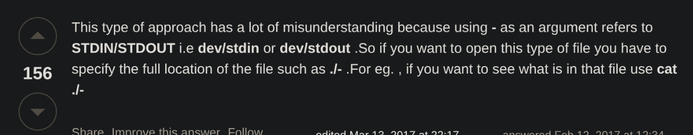
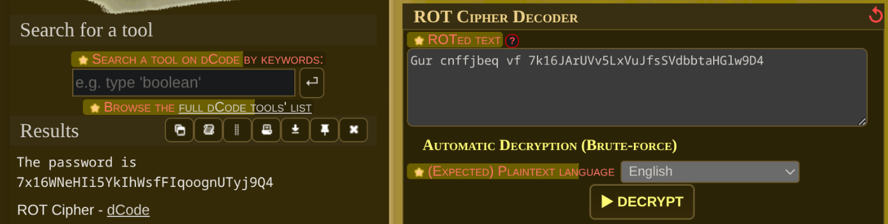

# Challenge-1 over-the-wire-bandit-game

---

## Level-0

---

### Description:

The goal of this level is for you to log into the game using SSH. The host to which you need to connect is bandit.labs.overthewire.org, on port 2220. The username is bandit0 and the password is bandit0.

---

**Command Used:**

```bash
ssh -p 2220 bandit0@bandit.labs.overthewire.org
Password: bandit0
```

---

## Level-1

---

### Description:

The password for the next level is stored in a file called readme located in the home directory. Use this password to log into bandit1 using SSH. Whenever you find a password for a level, use SSH (on port 2220) to log into that level and continue the game.

#### Commands:

To check the files in the current directory : **ls**

The result was the file _readme_

Then using the command to read the contents of the file: **cat**

The result was _The password you are looking for is: ZjLjTmM6FvvyRnrb2rfNWOZOTa6ip5If_

Now logging into the bandit1 using the command

`ssh -p 2220 bandit1@bandit.labs.overthewire.org`

---

## Level-2

---

### Description:

The password for the next level is stored in a file called - located in the home directory

#### Commands:

Used cat - but it didn't work then found the below on stack overflow


now using the command **cat ./-** result was _263JGJPfgU6LtdEvgfWU1XP5yac29mFx_

Now logging into the bandit2 using the command

`ssh -p 2220 bandit2@bandit.labs.overthewire.org`

---

## Level-3

---

### Description:

The password for the next level is stored in a file called spaces in this filename located in the home directory

#### Commands:

```bash
bandit2@bandit:~$ ls
spaces in this filename
bandit2@bandit:~$ cat spaces\ in\ this\ filename
MNk8KNH3Usiio41PRUEoDFPqfxLPlSmx
```

Now logging into the bandit3 using the command

`ssh -p 2220 bandit3@bandit.labs.overthewire.org`

---

## Level-4

---

### Description:

The password for the next level is stored in a hidden file in the inhere directory.

#### Commands:

```bash
bandit3@bandit:~$ ls
inhere
bandit3@bandit:~$ cd inhere
bandit3@bandit:~/inhere$ ls
bandit3@bandit:~/inhere$ ls -a
.  ..  ...Hiding-From-You
bandit3@bandit:~/inhere$ cat ...Hiding-From-You
2WmrDFRmJIq3IPxneAaMGhap0pFhF3NJ

```

Now logging into the bandit4 using the command

`ssh -p 2220 bandit4@bandit.labs.overthewire.org`

---

## Level-5

---

### Description:

The password for the next level is stored in the only human-readable file in the inhere directory. Tip: if your terminal is messed up, try the “reset” command.

#### Commands:

Using the file command to find the ASCII (human-readable file) and using cat to display the content

```bash
bandit4@bandit:~/inhere$ file ./*
./-file00: PGP Secret Sub-key -
./-file01: data
./-file02: data
./-file03: data
./-file04: data
./-file05: data
./-file06: data
./-file07: ASCII text
./-file08: data
./-file09: data
bandit4@bandit:~/inhere$ cat ./-file07
4oQYVPkxZOOEOO5pTW81FB8j8lxXGUQw


```

Now logging into the bandit5 using the command

`ssh -p 2220 bandit5@bandit.labs.overthewire.org`

---

## Level-6

---

### Description:

The password for the next level is stored in a file somewhere under the inhere directory and has all of the following properties:

- human-readable
- 1033 bytes in size
- not executable

#### Commands:

Found that there are many folders and each folder many files so searched for everyfile using file ./maybehere*/* and then pipe it with grep "ASCII" but it also gave many files.

Then googled how to find for a file with a particular size and then found that find has a option -size and for searching 1033 byte size use 1033c

```bash
bandit5@bandit:~/inhere$ file maybehere*/* | find -size 1033c
./maybehere07/.file2
bandit5@bandit:~/inhere$ cat ./maybehere07/.file2
HWasnPhtq9AVKe0dmk45nxy20cvUa6EG
```

Now logging into the bandit6 using the command

`ssh -p 2220 bandit6@bandit.labs.overthewire.org`

---

## Level-7

---

### Description:

The password for the next level is stored somewhere on the server and has all of the following properties:

- owned by user bandit7
- owned by group bandit6
- 33 bytes in size

#### Commands:

Found on unix.stackexchange how to search for files belonging to a particular group and particular user using -group "groupname" and -user "username" respectively and from previous problem already knew -size so used all and got many outputs with many _Permission denied_.
Read all the files that got printed and found only one file without any errors and then used cat command.

After more surfing on how to get rid of these permission denied errors found the **2>/dev/null** to redirect the stderr output to a null space making the procedure clean.

```bash
bandit6@bandit:~$ find / -user bandit7 -group bandit6 -size 33c 2>/dev/null
/var/lib/dpkg/info/bandit7.password
bandit6@bandit:~$ cat /var/lib/dpkg/info/bandit7.password
morbNTDkSW6jIlUc0ymOdMaLnOlFVAaj
```

Now logging into the bandit7 using the command

`ssh -p 2220 bandit7@bandit.labs.overthewire.org`

---

## Level-8

---

### Description:

The password for the next level is stored in the file data.txt next to the word millionth

#### Commands:

knew the direct command to search for a particular word in a file using grep

```bash
bandit7@bandit:~$ ls
data.txt
bandit7@bandit:~$ cat data.txt  | grep "millionth"
millionth	dfwvzFQi4mU0wfNbFOe9RoWskMLg7eEc
```

Now logging into the bandit8 using the command

`ssh -p 2220 bandit8@bandit.labs.overthewire.org`

---

## Level-9

---

### Description:

The password for the next level is stored in the file data.txt and is the only line of text that occurs only once

#### Commands:

as per my knowledge from the "ITW course" used the command

```bash
bandit8@bandit:~$ cat data.txt | sort | uniq -c | grep "1 "
      1 4CKMh1JI91bUIZZPXDqGanal4xvAg0JM
```

but found the option of -u in the uniq command which gives the line appearing only once directly

Now logging into the bandit9 using the command

`ssh -p 2220 bandit9@bandit.labs.overthewire.org`

---

## Level-10

---

### Description:

The password for the next level is stored in the file data.txt in one of the few human-readable strings, preceded by several ‘=’ characters.

#### Commands:

I firstly searched using _cat data.txt | grep "="_ which gave the error that it is a binary file match so I knew the option of -a in grep to read binary file matched data
so i used _cat data.txt | grep -a "="_ and kept on increasing the number of equal tos unless a readable string is beside those equaltos and i found the below finally

```bash
========== FGUW5ilLVJrxX9kMYMmlN4MgbpfMiqey
```

Now logging into the bandit10 using the command

`ssh -p 2220 bandit10@bandit.labs.overthewire.org`

---

## Level-11

---

### Description:

The password for the next level is stored in the file data.txt, which contains base64 encoded data

#### Commands:

Due to the participation in teh previous contests of Infosec I knew about the base64 command so direct solution was as below

```bash
bandit10@bandit:~$ ls
data.txt
bandit10@bandit:~$ cat data.txt | base64 --decode
The password is dtR173fZKb0RRsDFSGsg2RWnpNVj3qRr
```

Now logging into the bandit11 using the command

`ssh -p 2220 bandit11@bandit.labs.overthewire.org`

---

## Level-12

---

### Description:

The password for the next level is stored in the file data.txt, where all lowercase (a-z) and uppercase (A-Z) letters have been rotated by 13 positions

#### Commands:

since it was rotated by 13 and only alphabets i knew about caesar cipher and dcode.fr/en site so directly went there and set the relevant option and got the below

afterwards also got to know about the **tr** command of the terminal to do such stuff

Now logging into the bandit12 using the command

`ssh -p 2220 bandit12@bandit.labs.overthewire.org`

---

## Level-13

---

### Description:

The password for the next level is stored in the file data.txt, which is a hexdump of a file that has been repeatedly compressed. For this level it may be useful to create a directory under /tmp in which you can work. Use mkdir with a hard to guess directory name. Or better, use the command “mktemp -d”. Then copy the datafile using cp, and rename it using mv (read the manpages!)

#### Commands:

firstly what i knew was mktemp -d and cp and mv
so i did cd $(mktemp -d) followed by cp /home/bandit12/data.txt . (though i didn't rename it but i used mv in the further decompression commands)

i searched for the commands for hexdump and then to convert hexdump back to binary i got the command _xxd -r data.txt > data.bin_ then continually using file \<filename> and using the below commands respectively

- for gzip : renaming to .gz file and then using gunzip \<gz compressed data>
- for bzip2 : renaming to .bz2 file and then using bunzip \<bz2 compressed data>
- for POSIX tar archive : using tar -xf data.bin

> this is the result The password is FO5dwFsc0cbaIiH0h8J2eUks2vdTDwAn

Now logging into the bandit13 using the command

`ssh -p 2220 bandit13@bandit.labs.overthewire.org`

---

## Level-14

### Description:

The password for the next level is stored in /etc/bandit_pass/bandit14 and can only be read by user bandit14. For this level, you don’t get the next password, but you get a private SSH key that can be used to log into the next level. Note: localhost is a hostname that refers to the machine you are working on

#### Commands:

I didn't understand the question or the topic of how to login using private SSH key so i read the link attached with the problem statement about public and private keys and got to know how i can login to another computer without using the password if i have the private key using the command _-i option of ssh_ and the private rsa key stored in the file i did _ssh -i sshkey.private bandit14@localhost -p 2220_ (because they denied when i used the default port) and they read the /etc/bandit_pass/bandit14 file to get **MU4VWeTyJk8ROof1qqmcBPaLh7lDCPvS** as the password

Now logging into the bandit14 using the command

`ssh -p 2220 bandit14@bandit.labs.overthewire.org`

## Level-15

### Description:

The password for the next level can be retrieved by submitting the password of the current level to port 30000 on localhost.

#### Commands:

Now the levels are becoming really challenging and making me learn new things. For the current level I read about ports on how we can assign different ports for different things and for this level port 30000 on localhost that is the computer i have logged in is acting as a program which takes the previous password i.e., **MU4VWeTyJk8ROof1qqmcBPaLh7lDCPvS** as the input and gives the password required **8xCjnmgoKbGLhHFAZlGE5Tmu4M2tKJQo**.

`echo "MU4VWeTyJk8ROof1qqmcBPaLh7lDCPvS" | nc localhost 30000`

Now logging into the bandit15 using the command

`ssh -p 2220 bandit15@bandit.labs.overthewire.org`

## Level-16

### Description:

The password for the next level can be retrieved by submitting the password of the current level to port 30001 on localhost using SSL/TLS encryption.

Helpful note: Getting “DONE”, “RENEGOTIATING” or “KEYUPDATE”? Read the “CONNECTED COMMANDS” section in the manpage.

#### Commands:

goind through the "feisty duck" resource given found that openssl is used to connect over TLS that is with added encryption instead of just nc tcp connection so learnt about the commands from there and ran _openssl s_client -connect localhost:30001_ and submitted the previous level's password **8xCjnmgoKbGLhHFAZlGE5Tmu4M2tKJQo** and retrieved **kSkvUpMQ7lBYyCM4GBPvCvT1BfWRy0Dx**.

Now logging into the bandit16 using the command

`ssh -p 2220 bandit16@bandit.labs.overthewire.org`

## Level-17

### Description:

The credentials for the next level can be retrieved by submitting the password of the current level to a port on localhost in the range 31000 to 32000. First find out which of these ports have a server listening on them. Then find out which of those speak SSL/TLS and which don’t. There is only 1 server that will give the next credentials, the others will simply send back to you whatever you send to it.

#### Commands:

I read about the wikipedia Port Scanner article and found about nmap then searched it syntax used the command _nmap -p 31000-32000 localhost_ to get the 4 ports serving something or the other then checked each by the openssl command _openssl s_client -connect localhost:\<port number>_ and got the private rsa key from one of thems and them loginned to the other level using the command learnt earlier of ssh i.e., _ssh -i \<file i saved key into> bandit17@bandit.labs.overthewire.org -p 2220_.

## Level-18

### Description:

There are 2 files in the homedirectory: passwords.old and passwords.new. The password for the next level is in passwords.new and is the only line that has been changed between passwords.old and passwords.new

#### Commands:

I knew about the diff command so directly used _diff passwords.new passwords.old_ and got the change in the 42nd line and the password _x2gLTTjFwMOhQ8oWNbMN362QKxfRqGlO_

## Level-19

### Description:

The password for the next level is stored in a file readme in the homedirectory. Unfortunately, someone has modified .bashrc to log you out when you log in with SSH.

#### Commands:

This was told to us by Tanima ma'am how we can send commands directly to the remote host using ssh, so I thought of trying that but I didn't remember the command so searched for the syntax and got it _cGWpMaKXVwDUNgPAVJbWYuGHVn9zl3j8_.

## Level-20

### Description:

To gain access to the next level, you should use the setuid binary in the homedirectory. Execute it without arguments to find out how to use it. The password for this level can be found in the usual place (/etc/bandit_pass), after you have used the setuid binary.

#### Commands:

I got to know about how a file can be owned by another user but can be run using the user's which has the permission set to run can only run that, as said i ran that file and it said to run it with the command and i ran it with the command _cat /etc/bandit_pass/bandit20_ and got the password **0qXahG8ZjOVMN9Ghs7iOWsCfZyXOUbYO**

## Level-21

### Description:

There is a setuid binary in the homedirectory that does the following: it makes a connection to localhost on the port you specify as a commandline argument. It then reads a line of text from the connection and compares it to the password in the previous level (bandit20). If the password is correct, it will transmit the password for the next level (bandit21).

#### Commands:

I understood that i need to send that password to a port and simultaneouly run the setuid binary and also get the things being sent by it on that port. Due to previous levels I knew that to send data I needed nc with echo but how to listen also?? Searched and found the -l option in nc now how to run both using single terminal and then in the commands you need to know section saw "tmux" and thanks to that random "Network Chuck" recommendation on YT about TMUX that i knew how to use it and got the password **EeoULMCra2q0dSkYj561DX7s1CpBuOBt**.

## Level-22

### Description:

A program is running automatically at regular intervals from cron, the time-based job scheduler. Look in /etc/cron.d/ for the configuration and see what command is being executed.

#### Commands:

I kept on following and it finally gave the password.

```bash
bandit21@bandit:~$ cd /etc/cron.d
bandit21@bandit:/etc/cron.d$ ls
clean_tmp  cronjob_bandit22  cronjob_bandit23  cronjob_bandit24  e2scrub_all  otw-tmp-dir  sysstat
bandit21@bandit:/etc/cron.d$ cat cronjob_bandit22
@reboot bandit22 /usr/bin/cronjob_bandit22.sh &> /dev/null
* * * * * bandit22 /usr/bin/cronjob_bandit22.sh &> /dev/null
bandit21@bandit:/etc/cron.d$ cat /usr/bin/cronjob_bandit22.sh
#!/bin/bash
chmod 644 /tmp/t7O6lds9S0RqQh9aMcz6ShpAoZKF7fgv
cat /etc/bandit_pass/bandit22 > /tmp/t7O6lds9S0RqQh9aMcz6ShpAoZKF7fgv
bandit21@bandit:/etc/cron.d$ cat /etc/bandit_pass/bandit22
cat: /etc/bandit_pass/bandit22: Permission denied
bandit21@bandit:/etc/cron.d$ cat /tmp/t7O6lds9S0RqQh9aMcz6ShpAoZKF7fgv
tRae0UfB9v0UzbCdn9cY0gQnds9GF58Q
```

## Level-23

### Description:

A program is running automatically at regular intervals from cron, the time-based job scheduler. Look in /etc/cron.d/ for the configuration and see what command is being executed.

NOTE: Looking at shell scripts written by other people is a very useful skill. The script for this level is intentionally made easy to read. If you are having problems understanding what it does, try executing it to see the debug information it prints.

#### Commands:

Again just following what was told and understanding the pattern made the task easy.

```bash
bandit22@bandit:~$ cd /etc/cron.d
bandit22@bandit:/etc/cron.d$ ls
clean_tmp  cronjob_bandit22  cronjob_bandit23  cronjob_bandit24  e2scrub_all  otw-tmp-dir  sysstat
bandit22@bandit:/etc/cron.d$ cat cronjob_bandit23
@reboot bandit23 /usr/bin/cronjob_bandit23.sh  &> /dev/null
* * * * * bandit23 /usr/bin/cronjob_bandit23.sh  &> /dev/null
bandit22@bandit:/etc/cron.d$ cronjob_bandit23.sh
Copying passwordfile /etc/bandit_pass/bandit22 to /tmp/8169b67bd894ddbb4412f91573b38db3
bandit22@bandit:/etc/cron.d$ cat /etc/bandit_pass/bandit22
tRae0UfB9v0UzbCdn9cY0gQnds9GF58Q
bandit22@bandit:/etc/cron.d$ cat /usr/bin/cronjob_bandit23.sh
#!/bin/bash

myname=$(whoami)
mytarget=$(echo I am user $myname | md5sum | cut -d ' ' -f 1)

echo "Copying passwordfile /etc/bandit_pass/$myname to /tmp/$mytarget"

cat /etc/bandit_pass/$myname > /tmp/$mytarget
bandit22@bandit:/etc/cron.d$ echo "I am user bandit22" | md5sum
8169b67bd894ddbb4412f91573b38db3  -
bandit22@bandit:/etc/cron.d$ ls
clean_tmp  cronjob_bandit22  cronjob_bandit23  cronjob_bandit24  e2scrub_all  otw-tmp-dir  sysstat
bandit22@bandit:/etc/cron.d$ cat cronjob_bandit24
@reboot bandit24 /usr/bin/cronjob_bandit24.sh &> /dev/null
* * * * * bandit24 /usr/bin/cronjob_bandit24.sh &> /dev/null
bandit22@bandit:/etc/cron.d$ cat /ur/bin/cronjob_bandit24.sh
cat: /ur/bin/cronjob_bandit24.sh: No such file or directory
bandit22@bandit:/etc/cron.d$ cat /usr/bin/cronjob_bandit24.sh
cat: /usr/bin/cronjob_bandit24.sh: Permission denied
bandit22@bandit:/etc/cron.d$ echo "I am user bandit23" | md5sum
8ca319486bfbbc3663ea0fbe81326349  -
bandit22@bandit:/etc/cron.d$ cat /tmp/8ca319486bfbbc3663ea0fbe81326349
0Zf11ioIjMVN551jX3CmStKLYqjk54Ga
```

## Level-24

### Description:

A program is running automatically at regular intervals from cron, the time-based job scheduler. Look in /etc/cron.d/ for the configuration and see what command is being executed.

NOTE: This level requires you to create your own first shell-script. This is a very big step and you should be proud of yourself when you beat this level!

NOTE 2: Keep in mind that your shell script is removed once executed, so you may want to keep a copy around…

#### Commands:

Because of the description I knew that this requires writing a script when i followed the cronjob details as in the previous challenges i got to know that the script is running to execute and delete all the files of var/spool/${whoami}/foo. When I started searching for a folder like this I got to know that there is one existing i.e., _/var/spool/bandit24/foo_ now I understood that bandit23 has the permission to create a file here and which will be executed as bandit24 (I actually tried to read the password of bandit22,23 and 24 from /etc/bandit_pass/ which made me figure this out). Now I created a simple script to read the bandit24 password and store it in /tmp (as all the stdout output was sent to /dev/null) and after creating and saving the script and waiting for sometime I cat /tmp/pass24 and I got **gb8KRRCsshuZXI0tUuR6ypOFjiZbf3G8**.

## Level-25

### Description:

A daemon is listening on port 30002 and will give you the password for bandit25 if given the password for bandit24 and a secret numeric 4-digit pincode. There is no way to retrieve the pincode except by going through all of the 10000 combinations, called brute-forcing.
You do not need to create new connections each time

#### Commands:

I first how the output is like so I did "echo gb8KRRCsshuZXI0tUuR6ypOFjiZbf3G8 0000" | nc localhost 30002" getting back
"I am the pincode checker for user bandit25. Please enter the password for user bandit24 and the secret pincode on a single line, separated by a space. Wrong! Please enter the correct current password and pincode. Try again."
Then I ran a loop to find it out
`for i in $(seq -w 0000 9999); do echo "gb8KRRCsshuZXI0tUuR6ypOFjiZbf3G8 $i" | nc localhost 30002` but this was very slow as it setup new connection for every pin then as the question mentioned that's not needed, then I searched for it and found _coproc_ learnt about it and used the command

`coproc nc localhost 30002; read -r banner <&"${COPROC[0]}"; echo "Banner: $banner"; for i in $(seq -w 0000 9999); do echo "gb8KRRCsshuZXI0tUuR6ypOFjiZbf3G8 $i" >&"${COPROC[1]}"; read -r line <&"${COPROC[0]}"; echo "$i => $line"; [[ "$line" == *"bandit25"* || "$line" == *"Correct"* ]] && break; done`
(used chatgpt for this as wasn't able to make a command that runs continuously my every command was getting terminated in the first one only)

```bash
2216 => Wrong! Please enter the correct current password and pincode. Try again.
2217 => Wrong! Please enter the correct current password and pincode. Try again.
2218 => Wrong! Please enter the correct current password and pincode. Try again.
2219 => Correct!
bandit24@bandit:~$ echo "gb8KRRCsshuZXI0tUuR6ypOFjiZbf3G8 2219" | nc localhost 30002
I am the pincode checker for user bandit25. Please enter the password for user bandit24 and the secret pincode on a single line, separated by a space.
Correct!
The password of user bandit25 is iCi86ttT4KSNe1armKiwbQNmB3YJP3q4
```

## Level-26 and Level-27

### Description:

Logging in to bandit26 from bandit25 should be fairly easy… The shell for user bandit26 is not /bin/bash, but something else. Find out what it is, how it works and how to break out of it.

NOTE: if you’re a Windows user and typically use Powershell to ssh into bandit: Powershell is known to cause issues with the intended solution to this level. You should use command prompt instead.

#### Commands:

This level irritated me a lot, spent a lot of time at this though fater figuring out the shell using cat /etc/passwd | grep "bandit26" and finding that it is running the more command and then exiting.

Tried many things running a command beside ssh command to get something but nothing worked to which i finally searched for the clue and it said to literally do something to the size of terminal to stop the more command from finishing in between and I maximized the size and the more stopped in between and I opened vim using the v command inside more and then set the shell to bin/bash using **:set shell=/bin/bash** and finally using the setuid binary to get the password for the bandit27 as **upsNCc7vzaRDx6oZC6GiR6ERwe1MowGB**.

<!-- password for the bandit26 apart from the ssh private key s0773xxkk0MXfdqOfPRVr9L3jJBUOgCZ -->

## Level-28

### Description:

There is a git repository at ssh://bandit27-git@localhost/home/bandit27-git/repo via the port 2220. The password for the user bandit27-git is the same as for the user bandit27.

Clone the repository and find the password for the next level.

#### Commands:

Had to just clone a repo and read the password, first created a temporary directory using cd $(mktemp -d) and cloned using git clone, in the repo there was a README file and that had the password **Yz9IpL0sBcCeuG7m9uQFt8ZNpS4HZRcN**.

## Level-29

### Description:

There is a git repository at ssh://bandit28-git@localhost/home/bandit28-git/repo via the port 2220. The password for the user bandit28-git is the same as for the user bandit28.

Clone the repository and find the password for the next level.

#### Commands:

Again same procedure and cloned the repo and in the README.md file the password was xxxxxxxxxx so the password was changed in the README.md file so checked the git log and one of the commits said missing data got to that commit using git checkout \<commit-hash> and got the original password **4pT1t5DENaYuqnqvadYs1oE4QLCdjmJ7**;

## Level-30

### Description:

There is a git repository at ssh://bandit29-git@localhost/home/bandit29-git/repo via the port 2220. The password for the user bandit29-git is the same as for the user bandit29.

Clone the repository and find the password for the next level.

#### Commands:

After cloning and stuff found that the password is not there in the README.md instead there is a message that "no passwords in production". So checked branch using _git branch -r_ which might be there holding a password to be merged. I found two more branches dev and sploits-dev; did git checkout dev and found the password in it **qp30ex3VLz5MDG1n91YowTv4Q8l7CDZL**. (nothing was in sploits-dev i checked it afterwards)

## Level-31

### Description:

There is a git repository at ssh://bandit30-git@localhost/home/bandit30-git/repo via the port 2220. The password for the user bandit30-git is the same as for the user bandit30.

Clone the repository and find the password for the next level.

#### Commands:

Found the repo/README.md file empty and nothing inside searched for other remote branches any other commits every was NULL. Checked the stash too _git stash list_, nothing there too. Then searched for what else to check to find something hidden in a git repo, got to know about tags and git show-ref command which gave a reference and commit-hash to a tags/secret got to know about the cat-file function and its tags -t to find the type of file and -p to print it found the type to be blob(file) and printed it to get the password **fb5S2xb7bRyFmAvQYQGEqsbhVyJqhnDy**.

## Level-32

### Description:

There is a git repository at ssh://bandit31-git@localhost/home/bandit31-git/repo via the port 2220. The password for the user bandit31-git is the same as for the user bandit31.

Clone the repository and find the password for the next level.

#### Commands:

The README.md said to create a file key.txt with the content "May I come in?" and push it in master branch. I did it and found no changes in git status; I still commit and push and still no changes and then checked the hidden files for .gitignore and found that it had _\*.txt_ so changed and removed it and then pushed and boom the password **3O9RfhqyAlVBEZpVb6LYStshZoqoSx5K**.

## Level-33

### Description:

After all this git stuff, it’s time for another escape. Good luck!

#### Commands:

Got into the connection and found something like UPPERSHELL which converts every command you give to it as UPPERCASE and then runs it i tried doing basic cat ls man and nothing worked everything was permission denied. then i tried $ls and no errors were on this though i guess nothing was printed (i thought that it converted it to uppercase and ran but since no variable like LS was there nothing got printed). I then tried $PATH to check if builtin things work and it did so the next I tried was **$0** referring to the current shell being used it landed me into the bash shell and I read the password from /etc/bandit_pass/bandit33 which was **tQdtbs5D5i2vJwkO8mEyYEyTL8izoeJ0**.

```bash
bandit33@bandit:~$ cat README.txt
Congratulations on solving the last level of this game!

At this moment, there are no more levels to play in this game. However, we are constantly working
on new levels and will most likely expand this game with more levels soon.
Keep an eye out for an announcement on our usual communication channels!
In the meantime, you could play some of our other wargames.

If you have an idea for an awesome new level, please let us know!
```
