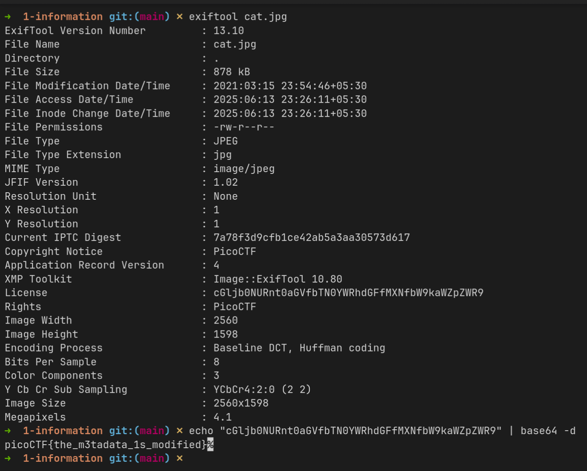
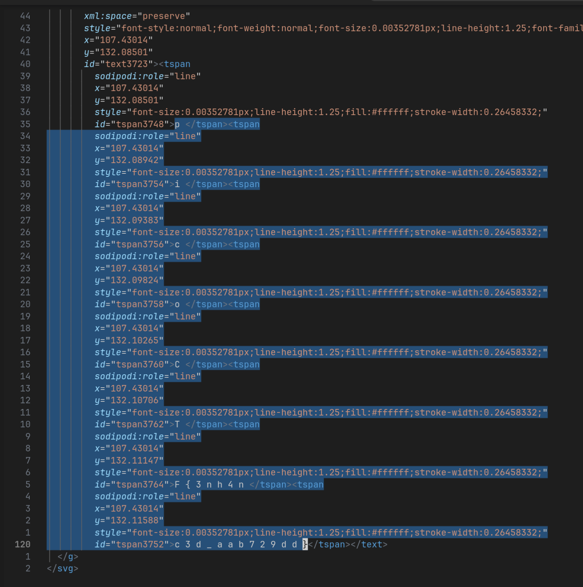

# Writeups for Week-1 Forensics 

### information

##### Challenge Description:
Files can always be changed in a secret way. Can you find the flag?
[cat.jpg](./1-information/cat.jpg)

##### Writeup:
Just used the **exiftool** command and it was enough to move ahead then.


### Matryoshka doll

##### Challenge Description:
Matryoshka dolls are a set of wooden dolls of decreasing size placed one inside another. What's the final one?
[image](./2-doll/dolls.jpg)

##### Writeup:
Checked the file format using **file** command and it said *png* instead of *jpeg* so used **zsteg** to get any internal data and found that it has extra data at the end which is a zip archive which I extracted using `binwalk -e dolls.jpg` and kept on doing till I found the flag.txt file.

Flag: `picoCTF{bf6acf878dcbd752f4721e41b1b1b66b}

### tunn3l v1s10n

##### Challenge Description: 

We found this [file](./3-tunnel/tunn3l_v1s10n). Recover the flag.

##### Writeup:
Doing...

### MacroHard WeakEdge

##### Challenge Description: 
I've hidden a flag in this file. Can you find it? [Forensics is fun.pptm](./4-weakedge/Forensics_is_fun.pptm)

##### Writeup:
Doing...


### Enhance!

##### Challenge Description: 

Download this image file and find the flag.
[Download image file](./5-enhance/drawing.flag.svg)

##### Writeup:
Didn't find anything using exiftool and binwalk so being an svg and having experience in dealing with SVG's I opened it using neovim and found the flag broken 
Flag: `picoCTF{3nh4nc3d_aab729dd}`

### advanced-potion-making

##### Challenge Description:

Ron just found his own copy of advanced potion making, but its been corrupted by some kind of spell. Help him recover it! 
[advanced-potion-making](./6-potion/advanced-potion-making)

##### Writeup:
Doing...


### File types

##### Challenge Description:
This file was found among some files marked confidential but my pdf reader cannot read it, maybe yours can.
You can download the file from [here](https://artifacts.picoctf.net/c/82/Flag.pdf).

##### Writeup:

Started with a .pdf file which wasn't opening.
Read the contents using cat and found it to be a bash script which I ran using 
`cat Flag.pdf | bash` and got the first archive name **flag** then kept on checking the filetype and using respective commands to extract it (commands include: ar, bunzip2, gunzip, lzip, lzop, cpio, lz4, lzma, xz) which finally lead to a ASCII text file which was hex-encoded which was decoded using `cat flag | xxd -r -p` to give the flag.

Flag: `picoCTF{f1len@m3_m@n1pul@t10n_f0r_0b2cur17y_950c4fee}`

### hideme

##### Challenge Description:

Every file gets a flag.
The SOC analyst saw one image been sent back and forth between two people. They decided to investigate and found out that there was more than what meets the eye [here](./8-hideme/flag.png).

##### Writeup:

Checked the `flag.png` file using exiftool and binwalk and extracted the data using `binwalk -e flag.png` and got the flag as an image in the secret folder.

Flag: `picoCTF{Hiddinng_An_imag3_within_@n_ima9e_96539bea}`


### MSB 

##### Challenge Description:

This image passes LSB statistical analysis, but we can't help but think there must be something to the visual artifacts present in this image...
Download the image [here](./9-msb/)


##### Writeup:

The challenge name suggested it was something related to MSB(Most Significant Bit) so started searching for tools online and found https://github.com/Pulho/sigBits which had the way to decode the MSB so used the command s

``` shell
python3 sigBits.py --type=Msb Ninja-and-Prince-Genji-Ukiyoe-Utagawa-Kunisada.flag.png

grep -o 'picoCTF{[^}]*}' outputSB.txt
```
 and got the Flag: `picoCTF{15_y0ur_que57_qu1x071c_0r_h3r01c_572ad5fe}`
 
 
 ### extensions
 
 ##### Challenge Description:
 
 This is a really weird text file [TXT](https://jupiter.challenges.picoctf.org/static/e7e5d188621ee705ceeb0452525412ef/flag.txt)? Can you find the flag?
 
 ##### Writeup:
 
 One of the easiest ones checked the filetype using `file flag.txt` and it said png so change the extension to **.png** and opened it and found the flag: `picoCTF{now_you_know_about_extensions}`